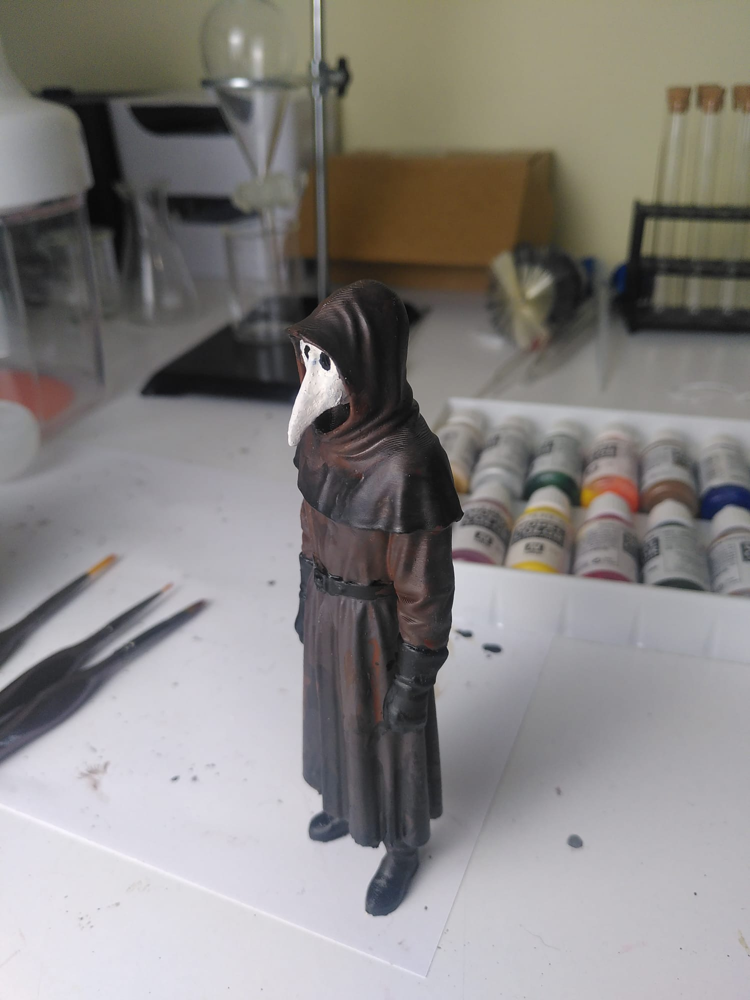
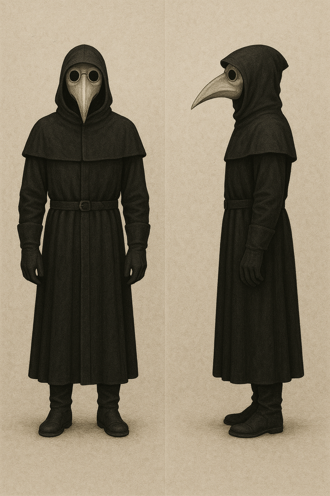

Figura 3D inspirada en SCP-049, el icónico Plague Doctor de la SCP Foundation. Lleva la túnica larga, guantes y la característica máscara medieval con pico.

Descarga del modelo (STL) en Thingiverse: https://www.thingiverse.com/thing:7203454

