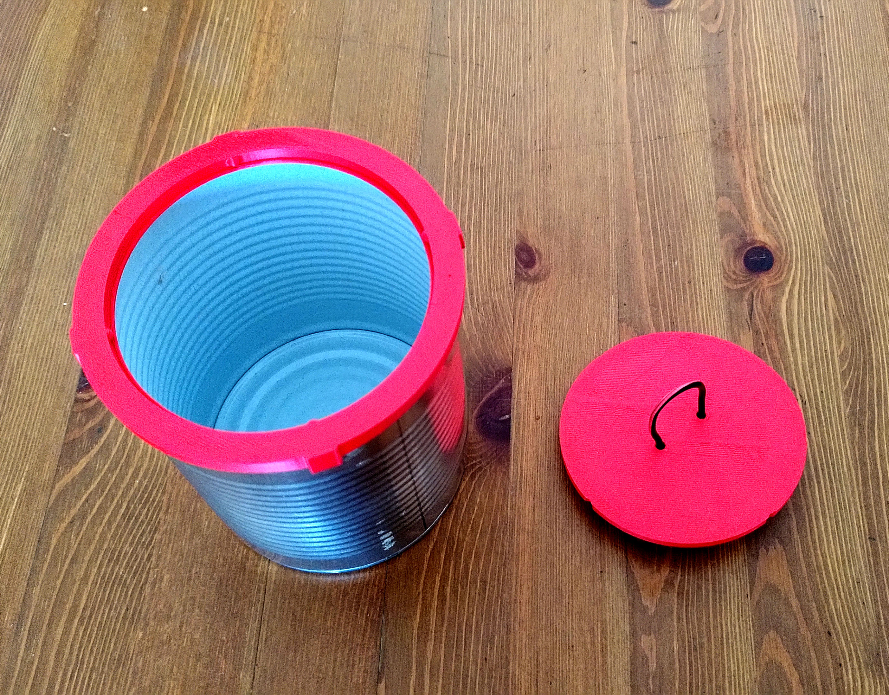
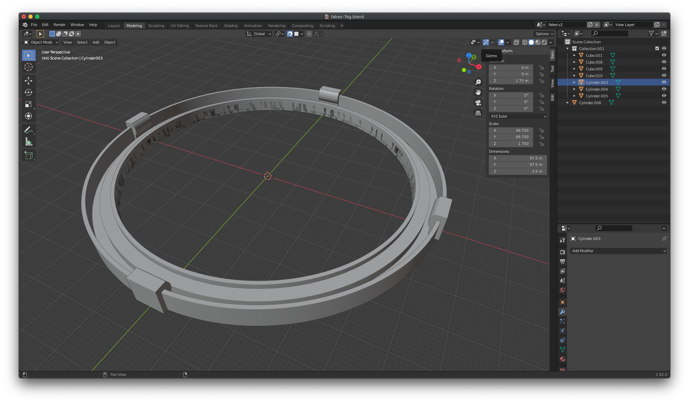

import VideoPlayer from "../../components/VideoPlayer.astro";

  <iframe
    src="https://video.nogafam.es/videos/embed/f91a5e8a-fb9a-49b2-a915-99fe5ce49183"
    allowfullscreen
    sandbox="allow-same-origin allow-scripts allow-popups"
    style="position:absolute; inset:0; width:100%; height:100%; border:0;"
    title="Tapa abatible"
  ></iframe>

<VideoPlayer
  src="https://youtu.be/4n6sr3g2tqE"
  title="Tapa abatible, pruebas"
/>

Dejo aquí el modelo en 3D hecho en Blender y los archivos exportados en formato STL por si alguien quiere hacerse unas tapas de botes de fabada.

- [fabes-1kg-stl.zip](/uploads/2021/03/fabes-1kg-stl.zip)
- [fabes-1kg-v5.blend\_.zip](/uploads/2021/03/fabes-1kg-v5.blend_.zip)

### Intentos fallidos

